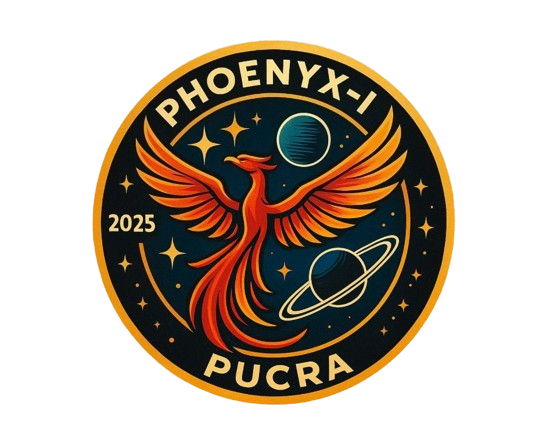
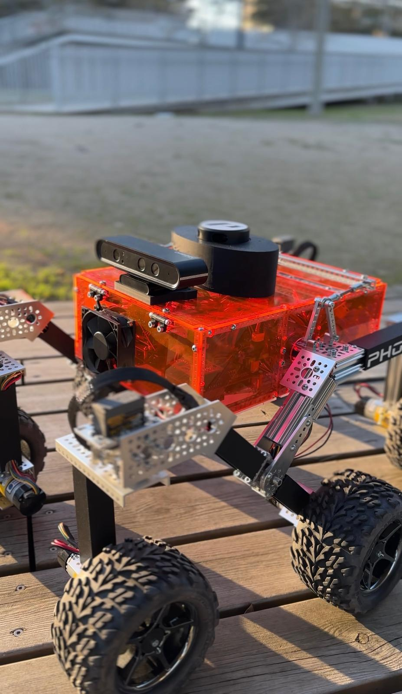

<!-- 🚨 TODO: Replace with your project logo -->
<p align="center">
  
</p>

# 🏆 Autonomous Rover – Winner of SENER-CEA Bot Talent 2025

**From Mars to the lab: a modular, perception-driven rover based on NASA’s design and engineered to excel in real-world autonomous navigation.**

---

## 🚀 Project Overview

This repository contains the complete source code and configuration for the autonomous rover that won the **SENER-CEA Bot Talent 2025** competition.

Originally based on the [NASA JPL Open Source Rover](https://github.com/nasa-jpl/open-source-rover), this project adapts the robust mechanical platform and transforms it into a fully autonomous vehicle capable of:

- Visual recognition of colors and digits.
- Continuous LiDAR-based navigation.
- SLAM localization and global path planning.
- Real-time decision making and goal tracking.

Built by students from **POLYTHECNIC UNIVERSITY OF CATALONIA**, this rover was designed with **computational efficiency**, **modular architecture**, and **robust performance** as guiding principles. It successfully passed all the competition challenges, including a final integrated mission with complex perception and navigation under time constraints.

---

## 🎯 Objectives

- Apply advanced robotics techniques in perception, planning, and control.  
- Implement a fully autonomous system that operates reliably in constrained indoor environments.  
- Validate the system both in simulation and on a real robot using only onboard processing.  
- Demonstrate the viability of autonomous systems on low-cost, open-source hardware.  

---

### 🔍 Control Task (LiDAR-only)


In this challenge, the robot had to **autonomously navigate narrow hallways using only 2D LiDAR**, with no predefined maps or waypoints. We addressed this with a custom ROS 2 node, `linea_media.py`, which combines **local perception** and **global goal planning** via Nav2.

The node continuously analyzes the LiDAR scan (-80º to 80º), detects the most open direction, transforms it to the global `map` frame, and sends a `PoseStamped` goal to Nav2—resulting in smooth and adaptive path planning.

Optimized for a **Raspberry Pi 4B**, the implementation uses lightweight techniques like block averaging, polar gap detection, and adaptive filtering to ensure **real-time, robust, and safe navigation**, proven both in simulation and on the competition floor.


**Highlights of the implementation:**
- 📡 Real-time goal generation using filtered 2D LiDAR data  
- 🧭 Global frame transformation with optimized TF usage  
- 🔄 Continuous state-machine loop triggered via joystick  
- 🧠 Dynamic timeout and collision-aware yaw corrections  
- ⚙️ Ultra-lightweight computation tailored for low-spec hardware  

This autonomous navigation system ran **indefinitely while power was available**, allowing the robot to adapt and respond fluidly to changes in the environment without operator intervention.

This test proved to be one of the most technically demanding—and rewarding—components of the entire competition.

---

## 🖼️ Media & Demonstrations

## Phoenyx-I in the sunshine
<p align="center">
  
</p>

- [📹 Perception Task](https://youtu.be/W66J1JEbJms)
- [📹 Control Task](https://youtu.be/W66J1JEbJms)
- [📹 Guiado Task](https://youtu.be/kr9DZYW80oY)
- [📷 Behind the Scenes](https://www.instagram.com/pucra.upc/)

---

## ⚙️ Development Environment

### System Requirements 

- **OS:** Ubuntu 22.04 LTS
- **ROS 2:** Humble Hawksbill
- **Hardware:**
  - Raspberry Pi 4B (4 GB RAM)
  - YDLidar X4
  - Orbbec AstraPro Plus RGB-D Camera
  - Adafruit BNO055 IMU
  - 6-wheel rocker-bogie base from JPL OSR
  - LiPo battery 4S 5200mAh
  - Arduhino for Neopixel Led control 
  - INA260n for battery state check
  - Emergency button 

### ⚠ Dependencies

- `slam_toolbox` – Real-time SLAM and map generation.
- `nav2` – Path planning and navigation stack.
- `rclpy`, `geometry_msgs`, `sensor_msgs`, `tf2_ros` – ROS core packages.
- `OpenCV`, `numpy` – Image and data processing.
- `joy`, `teleop_twist_joy` – Manual control.
- `rviz2`, `gazebo_ros` – Simulation and visualization
- `scickit-learn`- AI and image recognition

Install all dependencies via:

```bash
sudo apt update && sudo apt install\
  sudo apt install ros-humble-slam-toolbox\
  sudo apt install ros-humble-navigation2 ros-humble-nav2-bringup\
  sudo apt install ros-humble-joy\
  sudo apt install python3-opencv \
  sudo apt install python3-numpy\
  sudo apt install python3-sklearn\
```

## 📁 Repository Structure
### Main branch:

```bash
├── src/
    .
    ├── osr_bringup/     # Basic launch files and configuration for the OSR
    ├── percepcion/      # Image recognition, color and digit detection
    ├── guiado/          # SLAM-based localization and waypoint navigation
    ├── osr_control/     # roboclaw driver comunication and kinematics 
    ├── osr_interfaces/  # Custom mesages
    ├── phoenyx_nodes/   # Multiple nodes for diferent tasks and applications
    ├── planificador/    # Package for custom launch and yaml config.
    ├── ydlidar_ros2_driver/ #SDK for launching LiDAR 
    └── OrbbekSDK_ROS2/  #SDK for launching camera nodes  
```
- **`osr_bringup/`**: Launch files and yaml files for configuration of the basic items for the OSR.    
- **`percepcion/`**: Includes ROS 2 nodes for visual recognition of boxes, digits and colors.  
- **`guiado/`**: Manages SLAM, ArUco marker detection, and goal sequencing.  
- **`control/`**: Core logic for hallway following using LiDAR (`linea_media.py`).  
- **`osr_control/`**: Contains `rover.py` file responsable for the rover's oddometry and kinematics, also `roboclaw_wrapper.py` a node encharged of roboclaw driver comunications within `roboclaw.py` library.  
- **`phoenyx_nodes/`**: Multiple nodes for several purposes and tests
- **`ydlidar_ros2_driver/`**: Launch files and config files for launching the real lidar 
- **`planificador/`**: Contains launch file for global and local planifiers for Nav2 and yaml file for configurating Nav2 parameters. Moreover, a custom behaviour tree is been added.
- **`OrbbeckSDK_ROS2/`**: Necessary software for launching camera node. ⚠Warning⚠: Compilation takes quite long.

### Simulation branch:

```bash
├── src/
    .
    ├── osr_bringup/     # Basic launch files and configuration for the OSR
    ├── percepcion/      # Image recognition, color and digit detection
    ├── guiado/          # SLAM-based localization and waypoint navigation
    ├── osr_control/     # roboclaw driver comunication and kinematics 
    ├── osr_interfaces/  # Custom mesages
    ├── phoenyx_nodes/   # Multiple nodes for diferent tasks and applications
    ├── planificador/    # Package for custom launch and yaml config.
    ├── ydlidar_ros2_driver/ #SDK for launching LiDAR
    ├── osr_gazebo/      #SDK for launching LiDAR
    └── OrbbekSDK_ROS2/  #SDK for launching camera nodes  
```
- **`osr_gazebo/`**: Conains the C++ controller for simulating the OSR Rover. Also, custom `.worlds` with the competition challenges.Have Fun with that ;) 


## 🚦 How to Run the System

### 🧪 Simulation 

### For control task 
```bash
# Terminal 1 - Launch simulation world
ros2 launch osr_gazebo world.launch.py

# Terminal 2 - Launch SLAM
ros2 launch slam_toolbox online_async_launch.py use_sim_time:=true

# Terminal 3 - Launch Nav2
ros2 launch planificador planificador_launch.py use_sim_time:=true

# Terminal 4 - Launch LiDAR-based control node
ros2 launch control linea_media.launch.py use_sim_time:=true
```
### For guiado task
```bash
# Terminal 1 - Launch simulation world
ros2 launch osr_gazebo circuito_arucos.launch.py

# Terminal 2 - Launch SLAM
ros2 launch slam_toolbox online_async_launch.py use_sim_time:=true

# Terminal 3 - Launch Nav2
ros2 launch planificador planificador_launch.py use_sim_time:=true

# Terminal 4 - Launch Brain
ros2 run guiado brain_guiado.py use_sim_time:=true

# Terminal 5 - Publish a true on topic /aruco_scan
ros2 topic pub --once /aruco_scan std_msgs/Bool "{data: true}"

```
## 🤖 Real Robot 
### For percepcion task
``` bash
ros2 launch prueba_percepcion.launch.py 
```
### For control task 
```bash
ros2 launch control control.launch.py
```
### For guiado task 
```bash
ros2 launch guiado guiado.launch.py
```

The autonomous navigation is triggered using the joystick's **A button** **`(/joy topic)`** (you dont need to run anything or code).

## 🧠 Technical Highlights

- ✅ **Real-time LiDAR Navigation**: Uses 2D LiDAR to dynamically generate goals and follow the central path in corridors.  
- 🎯 **Perception-Driven Behavior**: Recognizes color-coded signs and digits to inform decision-making.  
- 🛰️ **Localization via SLAM + ArUco**: Integrates simultaneous mapping and landmark-based pose refinement.  
- ⚙️ **State Machine Architecture**: Clear transitions between behavior modules ensure robust autonomy.  
- 📈 **Fully Tuned Nav2**: Adjusted navigation parameters tailored for embedded hardware and tight-space reliability.

---

## 🏁 Competition Results

- 🥇 **First Place Overall – Bot Talent 2025**  
- 🧠 **Awarded for Best Robot Design**  
- 🛡️ Achieved zero collisions in critical navigation tests  

## 🧩 Contributors 

Developed by the **PUCRA - PHOENYX I Team** from **POLYTHECNIC UNIVERSITY OF CATALONIA**  
Mentored by engineers from **SENER** as part of the Bot Talent 2025 initiative.  
Built on the [NASA JPL Open Source Rover](https://github.com/nasa-jpl/open-source-rover) foundation.

---

## 🤝 Join Us

Want to build your own rover?  
Fork this repository, explore the modules, or contribute ideas.  
Let’s build the next generation of autonomous explorers together. 🌍🤖🚀


