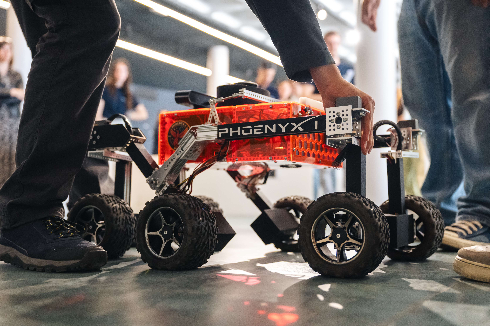
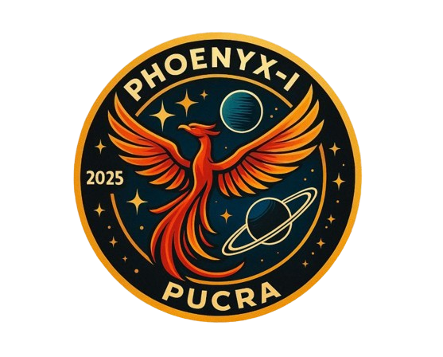

<p align="center">
  
</p>


> ### **🚀 From Mars to the Lab:**
>
> 🤖 **Meet Phoenyx I**, an autonomous exploration rover inspired by **NASA’s designs** — bringing **cutting-edge robotics** from the lab to Mars-like terrains.
>
> 🧠 Powered by **AI**, **computer vision**, **SLAM**, and **ROS 2**, Phoenyx I is engineered to handle both **Mars-analogue exploration** and **complex real-world robotics challenges**.
> 
> 🏆 **Winner of Best Overall Rover & Design Excellence** at **Sener-CEA's Bot Talent competition**, it’s not just a prototype, it’s a **proven platform** for **autonomous field robotics**.

---

 ## 👀 Watch it in action 
<table>
  <tr>
    <td>
      
    </td>
    <td>
      <ul>
        <li><a href="https://youtube.com/shorts/iHNUQLfxfGA?feature=share">📹 Perception Task</a></li>
        <li><a href="https://youtu.be/W66J1JEbJms">📹 Control Task</a></li>
        <li><a href="https://youtu.be/kr9DZYW80oY">📹 Guided Task</a></li>
        <li><a href="https://www.instagram.com/pucra.upc/">📷 Behind the Scenes</a></li>
        <li><a href="https://www.lavanguardia.com/launi/20250515/10686074/doble-victoria-equipo-upc-competicion-diseno-programacion-robots-superar-misiones-nasa.html">📈 Article in Spanish</a></li>
        <li><a href="https://www.group.sener/noticias/la-universidad-politecnica-de-catalunya-gana-la-final-de-sener-ceas-bot-talent-el-concurso-de-robotica-de-la-fundacion-sener-y-el-comite-espanol-de-automatica/">📈 Article in Sener's web</a></li>
      </ul>
    </td>
  </tr>
</table>

## 📂 What's Inside This Repository?

This repository includes the full **source code**, **ROS 2 packages**, and **system configurations** for **Phoenyx I**, the award-winning autonomous rover engineered by undergraduate students from **PUCRA**, the robotics association at the **Polytechnic University of Catalonia**. 

Base on [NASA JPL Open Source Rover](https://github.com/nasa-jpl/open-source-rover),this project enhances the base platform with a robust autonomy stack:
- 🔍 **Real-time perception** (color, digit recognition & ArUco makers) 
- 🗺️ **SLAM & LiDAR-based navigation**.
- 🧭 **Global and local path planning** with obstacle avoidance.
- 🧠 **Finite State Machine** (FSM) architecture in ROS 2.
- ⚙️ **Optimized performance on Raspberry Pi 4B.**

Phoenyx I demonstrates how high-performance autonomy can be achieved using **accessible hardware, efficient algorithms, and a ROS 2 architecture**, serving as a scalable platform for education, research, and field robotics experimentation.

## 📦 Jump to:

- [🚀 Quick Start ](#-quick-srtart)
- [🎯 Competition Challenges Overview](#-competition-challenge-overview)
- [🛠️ Development Environment](#%EF%B8%8F-development-environment)
- [📂 Repo Structure](#-repository-structure)
- [🚦 How to Run](#-how-to-run-the-system) 
- [🏁 Competition Results](#-competition-results)
- [🤝 Want to Collaborate?](#-want-to-collaborate)
- [🌐 Join & Follow Us](#-join--follow-us)

## 🚀 Quick Start 

### Raspberry Pi

To run Phoenyx I on the real robot, you first need to set up the onboard Raspberry Pi.

👉 **Follow the complete Raspberry Pi setup guide here:**  
➡️ [`docs/raspberry_pi_setup.md`](docs/raspberry_pi_setup.md)

### Steering Servo Calibration

Before operating the rover on real hardware, the steering servos **must be calibrated** to ensure all wheels are correctly aligned and the full steering range is used.

This procedure is **only required once**, or whenever a steering servo or corner assembly is replaced.

👉 **Follow the complete steering servo calibration guide here:**  
➡️ [`docs/steering_servo_calibration.md`](docs/steering_servo_calibration.md)

## 🎯 Competition Challenge Overview
The **SENER-CEA's Bot Talent** competition features a serie of challenges focused on **AMRs (Autonomus Mobile Robots)**, in which universities from across Spain compete by completing some tasks using an open source Rover. Our team successfully tackled all the proposed challenges:
- **[🔍 Perception Task](#-perception-task)**: Visual marker classification.
- **[🛣️ Control Task](#-control-task)**: Corridor navigation via LiDAR
- **[📍Guidance Task](#-guidance-task)**: Localization + waypoint following using ArUco.
- **🧩Final Challenge**:  Full autonomous mission combining all above tasks.
  
### 🔍 Perception Task

Given the **Raspberry Pi 4B's** limited **4GB memory**, we opted for a lightweight **k-Nearest Neighbors (kNN)** classifier instead of deep CNNs. This approach was combined with classical **computer vision technique** such as **morphological treatments**, **custom filtering**, and **image preprocessing** to isolate digits from their background. Additionally, a **stadistic analysis** was employed for accurate **color detection**. This combination enabled **fast** and **reliable digit and color recognition** with **minimal computational overhead**.

### 🛣️ Control Task
In this challenge, the robot had to **autonomously navigate narrow hallways using only 2D LiDAR**, without predefined maps or waypoints. We developed a custom ROS 2 node, `linea_media.py`, that combines **local perception** and **global goal planning** via Nav2.

The node continuously processes the LiDAR scan data (-80º to 80º), **identifies** the most **open path**, **projects the best direction** to the global `map` frame, and **publish a `PoseStamped` goal** to Nav2.

Optimized for the **Raspberry Pi 4B**, it leverages lightweight methods like **block averaging, polar gap detection, and adaptive filtering** to ensure **real-time, robust, and safe operation**, validated in both simulation and on the competition floor.

### 📍 Guidance Task 

In this challenge, the robot had to **localize itself using ArUco markers** markers from an unknown starting position. This was handled by `brain.py` (a finite state machine (FSM) that coordinates all nodes) and `localizacion_aruco.py`, which scan **ArUco markers** and triggers an **odometry reset** via manual **frame transformations**.

To ensure safty, the system loads a predifined `map` to keep the robot within fiel boundaries.

## 🛠️ Development Environment

### System Requirements 

- **OS:** Ubuntu 22.04 LTS
- **ROS 2:** Humble Hawksbill
- **Hardware:**
  - Raspberry Pi 4B (4 GB RAM)
  - YDLidar X4
  - Orbbec AstraPro Plus (RGB-D Camera)
  - Adafruit BNO055 IMU
  - Arduino (for Neopixel Led control)
  - INA260n (for battery monitor)
  - LiPo battery 4S
  - Joystick controller
  - Emergency button 
  - Mechanical components based on the [NASA JPL Open Source Rover](https://github.com/nasa-jpl/open-source-rover)
  
### ⚠ Dependencies

- `slam_toolbox` – Real-time SLAM and map generation.
- `nav2` – Navigation and planning stack.
- `rviz2`, `gazebo_ros` – Simulation and visualization
- `rclpy`, `geometry_msgs`, `sensor_msgs`, `tf2_ros` – ROS core communication.
- `OpenCV`, `numpy` – Computer vision and data ops.
- `joy`, `teleop_twist_joy` – Manual joystick control.
- `scickit-learn`- AI and image recognition

## 📁 Repository Structure

```bash
├── src/
│   ├── osr_bringup/            # Basic launch files and configuration for the OSR
│   ├── osr_control/            
│   ├── osr_control_challenge/  # Code for the control task
│   ├── osr_gazebo/             # Simulation environment for Gazebo
│   ├── osr_interfaces/         # Custom ROS messages
│   ├── percepcion/             # Image recognition, color and digit detection
│   ├── phoenyx_nodes/          # Multiple nodes for different tasks and applications
│   ├── planificador/           # Package for custom launch and YAML configuration
│   ├── guiado/                 # SLAM-based localization and waypoint navigation
│   ├── control/                
│   ├── datos/                  
│   └── final/                  
│
├── LICENSE.md
├── JPL_NASA_LICENCE.txt
└── README.md

```

## 🚦 How to Run the System

### 🧪 In Simulation 

#### Empty Worlds
```bash
# Launch an empty world on gazebo with the rover model
ros2 launch osr_gazebo empty_world.launch.py

# Launch an empty world on gazebo and rviz with the simplified model of the rover model
ros2 launch osr_gazebo empty_world_simplified.launch.py

# Launch rviz with the rover model
ros2 launch osr_gazebo rviz.launch.py

# Launch rviz with the simplified model of the rover model
ros2 launch osr_gazebo rviz_simplified.launch.py 
```

### Move With a Controller
```bash
# With an open gazebo world with the rover model you can use a controller to move it
ros2 launch osr_bringup joystick_launch.py 
```

> [!NOTE]
> For details on the controller layout, how to change the joystick mapping, and a deeper explanation of how the teleoperation pipeline works, see: [Joystick Teleoperation Documentation](docs/joystick_teleoperation.md)

#### Control Task (Without Nav2)
This mode is used to evaluate the rover’s control and navigation behavior inside a **maze environment**.
Three maze worlds are provided, each with different layouts and difficulty levels.

Available maze worlds:
- maze_1.world — basic layout, suitable for tuning and testing.
- maze_2.world — intermediate complexity.
- maze_3.world — advanced maze for full control evaluation.

```bash
# Terminal 1 - Launch the simulation world with the desired maze
ros2 launch osr_bringup maze_simulation.launch.py maze:=maze_1.world
# or
ros2 launch osr_bringup maze_simulation.launch.py maze:=maze_2.world
# or
ros2 launch osr_bringup maze_simulation.launch.py maze:=maze_3.world

# Terminal 2 - Run the control challenge node
ros2 run osr_control_challenge maze_navigation
```

#### Guidance Task

```bash
# Terminal 1 - Launch simulation world
ros2 launch osr_gazebo circuito_arucos.launch.py

# Terminal 2 - Launch SLAM
ros2 launch slam_toolbox online_async_launch.py use_sim_time:=true

# Terminal 3 - Launch Nav2
ros2 launch planificador planificador_launch.py use_sim_time:=true

# Terminal 4 - Launch Brain
ros2 run guiado brain_guiado.py use_sim_time:=true

# Terminal 5 - Publish a true on topic /aruco_scan
ros2 topic pub --once /aruco_scan std_msgs/Bool "{data: true}"

```

### 🤖 On Real Robot 
#### For percepcion task
``` bash
ros2 launch prueba2_percepcion.launch.py 
```
#### For control task 
```bash
# Terminal 1 
ros2 launch control control.launch.py

# Terminal 2
ros2 launch control planificador.launch.py
```
#### For guiado task 
```bash
ros2 launch guiado guiado.launch.py
```

> [!note]
> Press A on the joystick to start autonomous mode `/joy` topic.
>
>  See [Orbbec ROS 2 README](https://github.com/PUCRA/Phoenyx/tree/main/OrbbecSDK_ROS2) for camera setup.

## 🏁 Competition Results

- 🥇 **First Place Overall – Bot Talent 2025**  
- 🧠 **Awarded for Best Robot Design**   

## License

This main project, including all contributions by PUCRA and its collaborators, is licensed under the **[MIT License](LICENSE)**.

Parts of this project derived from the work of the **Jet Propulsion Laboratory (JPL) of NASA** are covered by the **[Apache License, Version 2.0](JPL_NASA_License.txt)**. Please refer to the `JPL_NASA_License.txt` file for full terms and original attributions.

## 🤝 Want to Collaborate?

If you're interested in contributing code, improving documentation, or developing new features, feel free to check our [CONTRIBUTING](.github/CONTRIBUTING.md) page!

## 🌐 Join & Follow Us

Stay connected with PUCRA and follow our journey:

[](mailto:pucra.eebe@upc.edu) 
[](https://www.linkedin.com/company/pucra-upcc/posts/?feedView=all)
[](https://www.instagram.com/pucra.upc/)
[](https://www.youtube.com/@pucraupc) 

<p align="center">
  
</p>

