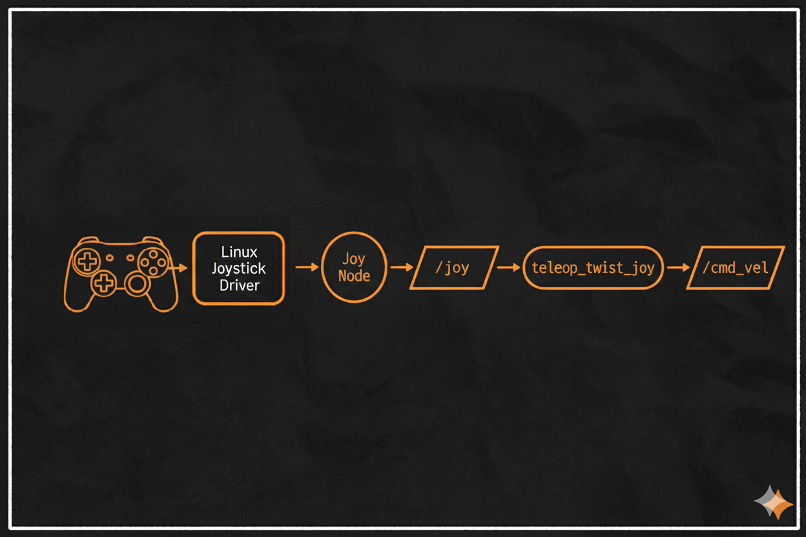
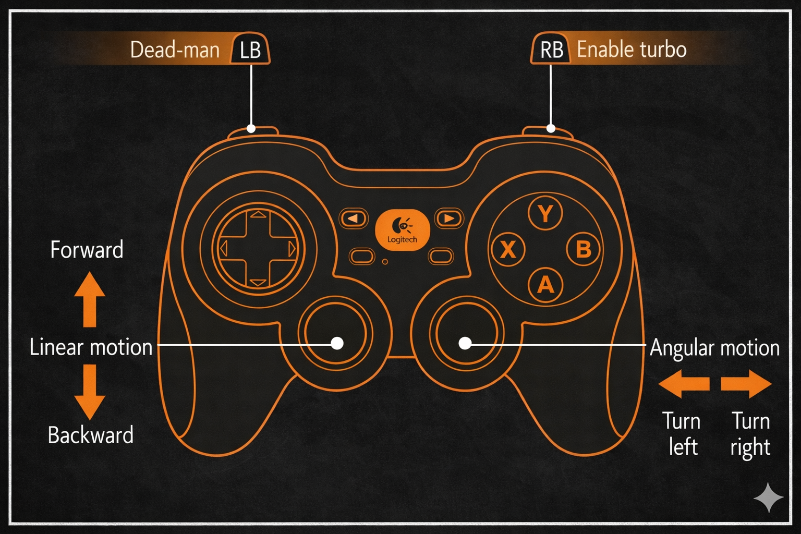

# Joystick Teleoperation

This document describes how to control the robot using a joystick in ROS 2.
It explains the joystick [Teleoperation Architecture](#teleoperation-architecture), how joystick inputs are
processed and converted into velocity commands, and how the [Controller is
Mapped](#controller-mapping-logitech-f710) for robot motion.

It also provides guidance on how to adapt the [Configuration to Different
Joystick Devices](#joystick-configuration) by adjusting the device ID, axis mapping, and button
assignment.

## Teleoperation Architecture

Joystick teleoperation is implemented using the `joy` and
`teleop_twist_joy` ROS 2 packages.

The `joy` node reads raw input from the Linux joystick driver and publishes
it as `sensor_msgs/Joy`. The `teleop_twist_joy` node processes this data and
converts it into velocity commands (`geometry_msgs/Twist`) published on
`/cmd_vel`.

The figure below shows the complete data flow, from the physical controller
to the velocity commands sent to the robot base.

<p align="center">
  
</p>

> [!NOTE]
> For a practical overview of wireless joystick control for robots in ROS, see the following video:
> https://www.youtube.com/watch?v=F5XlNiCKbrY

## Controller Mapping (Logitech F710)

The following image shows the joystick mapping used to control the robot.

<p align="center">
  
</p>
 
### Controller Mapping

| Type   | Function   | Control               | Description |
|--------|------------|-----------------------|-------------|
| Axis   | Linear X   | Left stick (Y axis)   | Move forward / backward |
| Axis   | Angular Z  | Right stick (X axis)  | Turn left / right |
| Button | Enable     | LB                    | Dead-man switch |
| Button | Turbo mode | RB                    | Increase maximum speed |

> [!IMPORTANT]
> Velocity commands are only published while either the dead-man switch or the turbo mode button is pressed.

> [!NOTE]
> When rotating in place (zero linear velocity), pushing the joystick clockwise results in a counterclockwise rotation of the robot. When rotation is combined with linear motion, the robot rotates in the expected direction according to the joystick input.

## Joystick Configuration

This section explains how to adapt the joystick configuration to different
hardware setups. All joystick-related parameters are defined in
`osr_bringup/config/joystick.yaml`.

Configuration involves selecting the correct [Joystick ID](#changing-the-joystick-device-id) device and adjusting the [Axis and Button Mapping](#changing-the-joystick-mapping) to match the controller being used.

### Changing the Joystick Device ID

If multiple joysticks or other devise are connected, the correct device ID must be selected.

List all available joystick devices:

```bash
ros2 run joy joy_enumerate_devices
```

Set the desired device ID in `joystick.yaml` indise de joy_node:

```yaml
device_id: <device_id>
```

### Changing the Joystick Mapping

Different controllers may use different axis and button indices. To ensure
the correct mapping, the joystick inputs must be identified and then assigned
in `joystick.yaml`.

#### Identify axis and button indices

1. Start the `joy` node with the correct device ID:

    ```bash
    ros2 run joy joy_node --ros-args -p device_id:=<device_id>
    ```

2. In a second terminal, run the joystick test tool:
    ```bash
    ros2 run joy joy_tester test_joy
    ```

> [!WARNING]
> The joy_tester tool launches a graphical interface. If you are running this command on a Raspberry Pi without a desktop environment, the GUI will not be visible. It is recommended to perform joystick identification on a PC with a graphical interface.

3. Move each axis and press each button while observing which index changes.

#### Update the configuration 
Use the observed indices to update the mapping in `joystick.yaml`:

```yaml
axis_linear:
  x: <axis_index>

axis_angular:
  yaw: <axis_index>

enable_button: <button_index>
enable_turbo_button: <button_index>
```

Velocity limits can be adjusted using the scale parameters:

```yaml
scale_linear:
  x: <max_linear_speed>

scale_angular:
  yaw: <max_angular_speed>
```

> [!NOTE]
> The `inverted_reverse` parameter can be enabled to invert the turning direction while driving backward, which may feel more intuitive for the user.