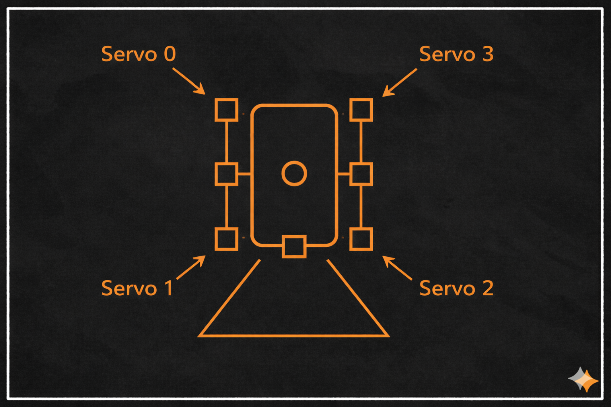

# Steering Servo Calibration

This document describes how to calibrate the corner steering servomotors. Proper calibration ensures that all wheels are aligned correctly and that the full steering range of each servo is used.

This procedure only needs to be performed once, or whenever a servo or corner assembly is replaced.


## Prerequisites

- Robot powered on
- Servos connected and functional
- Wheels able to rotate freely (robot lifted or supported)
- Terminal access to the robot


## 1. Mechanical Zero and Servo Centering

Each corner uses an absolute encoder, but the mechanical zero position must be calibrated manually.

### 1.1. Detach the Corner Assemblies

1. Remove the screw that connects each corner assembly to the servo output shaft.
2. Detach all four corner assemblies so the servos can rotate freely.

### 1.2. Move Servos to the Center Position

The steering servos have a usable range of approximately 0–300 degrees. The center of this range (150 degrees) will be used as the reference position.

Run the following commands:

```bash
cd ~/phoenyxI_ws/src/scripts
python3 calibrate_servos.py 0 150
python3 calibrate_servos.py 1 150
python3 calibrate_servos.py 2 150
python3 calibrate_servos.py 3 150
```

This diagram shows the servo channel numbering and their physical location on the robot (0: Rear right, 1: Front right, 2: Front left, 3: Rear left).
<p align="center">
  
</p>

> [!NOTE]
> If a servo does not move, try a different angle (e.g. 200) to verify that it is responding. If it still does not move, check wiring and hardware connections.


### 1.3. Reattach the Corner Assemblies

1. Reattach each corner assembly to its servo shaft.
2. Secure it using the original screw.
3. Apply a small amount of thread locker (e.g. blue Loctite) to prevent the screw from loosening during operation.

Perfect alignment is not required at this stage.

## 2. Fine Wheel Alignment and Calibration Storage

This section fine-tunes the wheel alignment and stores the resulting calibration values for future use.

### 2.1. Fine Alignment of Each Wheel
Each wheel must now be aligned so that it points exactly straight ahead.

For each servo:
1. Command the servo to a slightly different angle.
2. Observe the wheel orientation.
3. Adjust until the wheel is visually centered.

Example (rear right corner):

```bash
python3 calibrate_servos.py 0 160
```

Repeat until the wheel is perfectly aligned, and record the final value for each servo.

### 2.2. Store Calibration Values

Once all four wheels are aligned, you should have four center values
(e.g. [160, 155, 125, 162]).

Open the launch file located in:

```bash
~/phoenyxI_ws/src/osr_bringup/launch/osr_mod_launch.py
```

Locate the parameter:

```python
centered_pulse_widths: [165, 134, 135, 160]
```

Replace the values with the ones you measured, save the file and exit.